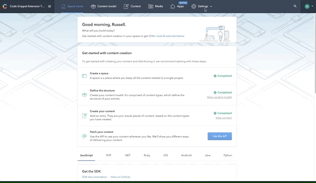

# Contentful Code Snippets
## Entry Editor Extension for the Contentful CMS

## Overview

This extension was made using the [Contentful Extentions CLI]("https://github.com/contentful/contentful-extension-cli").
Testing and a large majority of modeling comes directly from the output generated from 
```
    npx @contentful/create-contentful-extension code-snippet
```

## Features

- All coding styles and syntax highlighting offered from highlight.js
- Instant re-rendering of previews with new input

## TO USE Extension

This assumes that you already have a Contentful account and a space where you can add extensions and content models.

### Create, Name and connect hosted extension


- Under the Settings menu, click Extensions
- On the top right corner, click "Add Extension" and click the dropdown item "Add a new Extension"
- Enter whatever name you like and select 'Self-hosted' under the Hosting section
- paste the url ```https://elegant-elion-42cffe.netlify.com/``` into the url address
- click save at the top right. Now we can make a custom content type!

### Create Content model


1) Click on "Content model" in the nav bar
2) Click on "Add content type" in the top right corner
3) Name the content type whatever you like, but remember what you named it for later
4) In the right Sidebar under "ENTRY EDITOR APPEARANCE" select "Use custom editor" and select the extension we just installed ("Code Snippet") from the dropdown menu.
5) In the right sidebar click "Add field" and select text
6) Enter "title" the name field
7) Click "Create" on the left
8) repeat steps 5-7 creating text fields for "language", "theme" and "code"
9) At the end, you should have 4 text fields named "title", "language", "theme" and "code"
10) Hit save on the top right corner.  Now we can add some content!

### Create Content with extension


1) Click on "Content" in the nav bar
2) Click on "Add entry" in the top right corner and choose the content type you just made
3) Enter a title and select the language and highlighting theme that your code snippet will be in
4) Paste your code snippet into the box under "Code Snippet"
5) OPTIONAL - Change the highlight themes to see which one you like the most
6) click publish and your content it saved!


## TO RUN

git clone this repo then cd into the folder
```
cd styled-code-snippets
```
install dependencies
```
npm i
```
log in to contentful using the contentful CLI login command
```
contentful login
```
Follow the instructions to enter your access token

fire up the dev server
```
npm run start
```

## DEVELOPMENT
To run tests:
```
    npm run test
```

If more styles are added to the highlight.js package, they can be extracted using the following node script:
```
    node src/generateStyles
```
This will generate and highlightStyles.js in /src containing all highlight.js coding themes in an array exported by default

## KNOWN BUGS
- typing into code editor it possible, but deleting text moves the cursor down to the bottom of the div
- if errors found in the language linting, saving is not possible.  Although this provides some quality control, snippets may be out of context and may not have all variables and should therefore be allowed to have variables that are not explicitly declared
- Instance varibales are available and loaded thourgh extension.json, but it is not being read and but cannot be manually entered into Contentful.


## FURTHER DEVELOPMENT / NOTES

- Contribute to Highlight.js package a ```getAllStyles()``` function to eliminate the generateStyles script
- Research different in browser text editors as "EditableDiv" may not be the best solution
- add option to auto create codepen / gist (ideally with style kept throughout)

---
### Contentful Improvements / Questions

*Extension CLI*
- Prompt that space is created before starting (maybe confirm first, or auto create a space?)

*Backend*
- When custom editor selected, it would be great to add fields automatically. It's Hard to remember to add each field and which one the instance variables override
- A faster way to delete many content types would be helpful in testing similar to the content functionality (select all and group actions)
